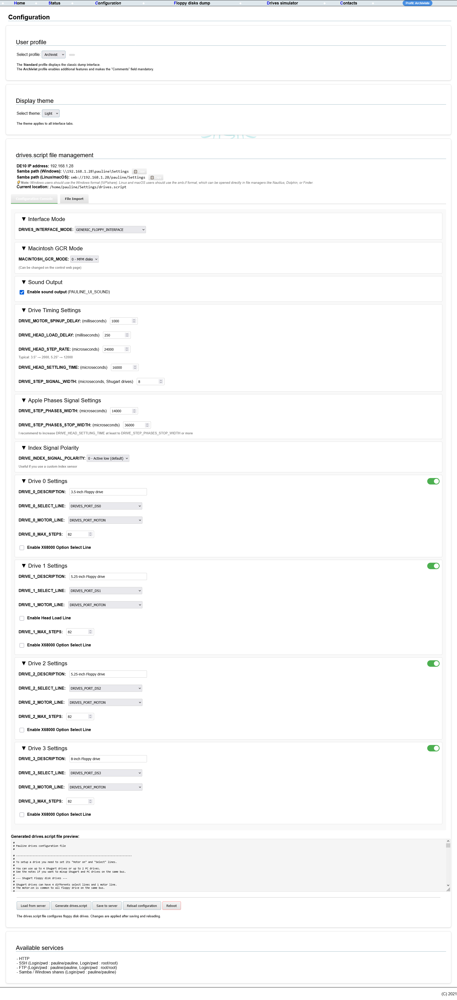
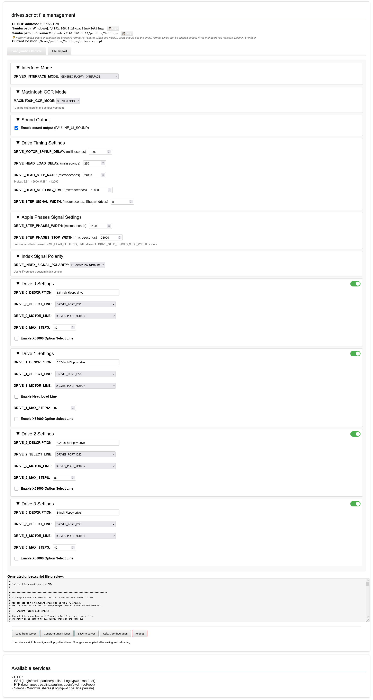
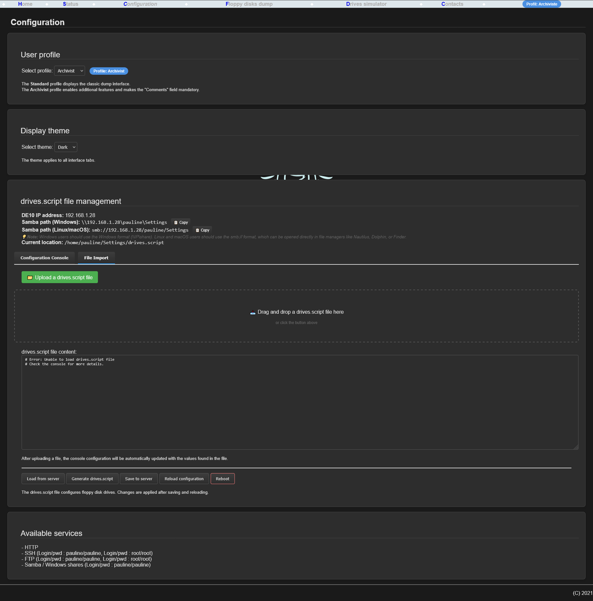
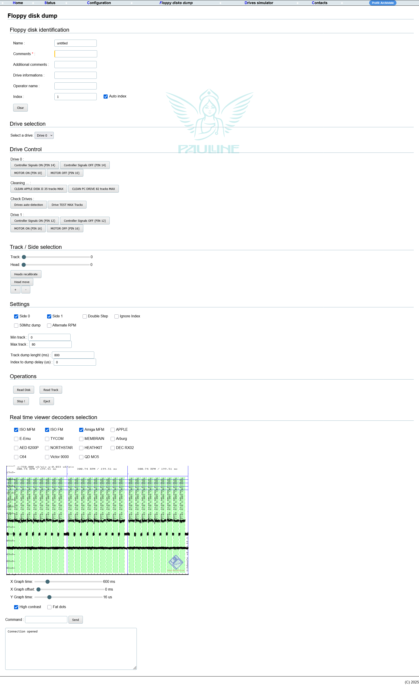
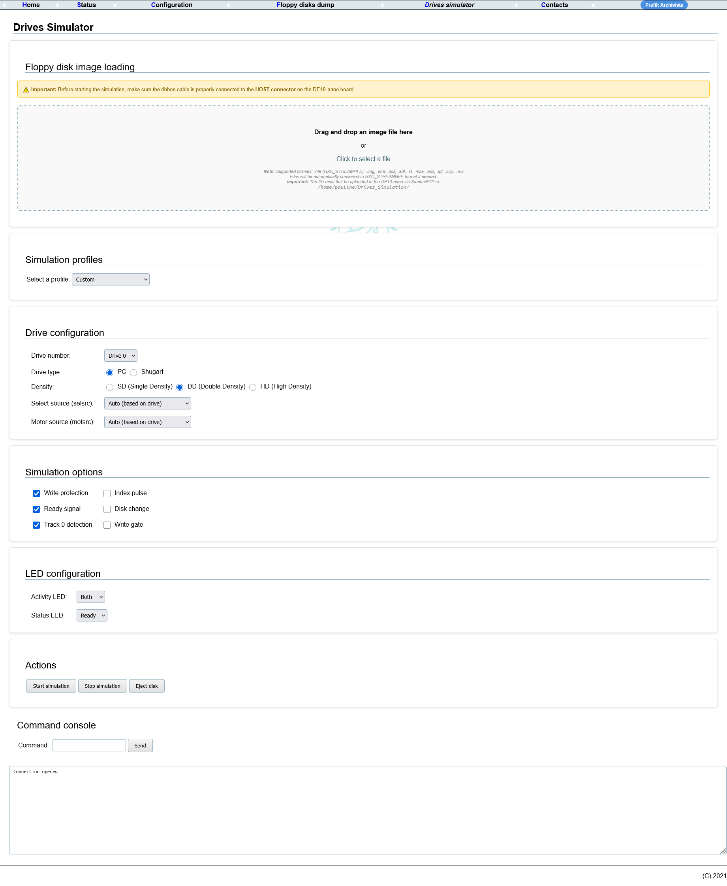
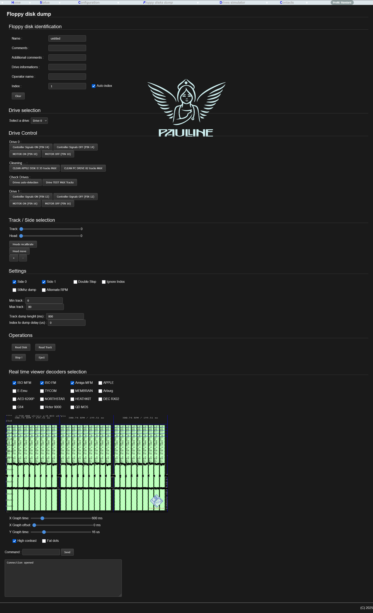

# 📚 Documentation Pauline - Compilation et Déploiement

## 📑 Table des matières

1. [🔨 Compilation du projet Pauline](#compilation-du-projet-pauline)
2. [🌐 Modification de la page web](#modification-de-la-page-web)
3. [📜 Scripts de déploiement et gestion](#scripts-de-déploiement-et-gestion)
   - [deploy.sh - Déploiement du binaire](#deploysh---déploiement-du-binaire)
   - [deploy_www.sh - Déploiement des fichiers web](#deploy_wwwsh---déploiement-des-fichiers-web)
   - [restore.sh - Restauration d'une sauvegarde](#restoresh---restauration-dune-sauvegarde)
   - [retrieve_www.sh - Récupération des fichiers web](#retrieve_wwwsh---récupération-des-fichiers-web)
   - [compare_www.sh - Comparaison des fichiers web](#compare_wwwsh---comparaison-des-fichiers-web)
4. [🔄 Workflow complet](#workflow-complet)
5. [🔧 Dépannage](#dépannage)

---

## 🔨 Compilation du projet Pauline

### 📋 Prérequis

- Un système Linux avec `build-essential` installé
- Le cross-compilateur ARM : `arm-linux-gnueabihf-gcc`
- Les dépendances nécessaires (libpng, etc.)

### 🎯 Compilation pour ARM (DE10-nano)

Pour compiler le binaire `pauline` pour la carte DE10-nano :

```bash
cd Softwares_Pauline/Pauline_control
make CC=arm-linux-gnueabihf-gcc clean
make CC=arm-linux-gnueabihf-gcc
```

Le binaire `pauline` sera généré dans le répertoire courant.

### 🐛 Compilation en mode debug

Pour compiler avec les symboles de debug :

```bash
make CC=arm-linux-gnueabihf-gcc DEBUG=1 clean
make CC=arm-linux-gnueabihf-gcc DEBUG=1
```

### 🧹 Nettoyage

Pour nettoyer les fichiers de compilation :

```bash
make clean      # Supprime les fichiers objets et le binaire
make mrproper   # Supprime également le répertoire obj
```

### ✅ Vérification du binaire

Avant le déploiement, vérifiez que le binaire est bien compilé pour ARM :

```bash
file pauline
```

Vous devriez voir quelque chose comme : `pauline: ELF 32-bit LSB executable, ARM, ...`

---

## 🌐 Modification de la page web

### 📁 Localisation des fichiers web

Les fichiers web se trouvent dans :
```
Linux_Pauline/targets/Pauline_RevA_de10-nano/config/rootfs_cfg/www/
```

### 📂 Structure des fichiers

Les fichiers principaux sont organisés de manière modulaire :

**📜 Fichiers JavaScript** :
- `pauline.js` - Logique JavaScript principale (communication WebSocket, commandes)
- `profile.js` - Gestion des profils utilisateurs et thèmes
- `drives-script.js` - Gestion complète du fichier drives.script (génération, parsing, upload, sauvegarde)
- `config.js` - Fonctions spécifiques à la page config.html (interface, onglets, sections)

**📄 Fichiers HTML** :
- `index.html` - Page d'accueil
- `status.html` - Page de statut
- `config.html` - Page de configuration (profils, thèmes, drives.script)
- `dump.html` - Interface de dump de disquettes
- `simulator.html` - Simulateur de lecteurs de disquettes avec drag & drop

**🎨 Fichiers de style** :
- `style.css` - Styles CSS avec support thème clair/sombre

**Note** : Le JavaScript a été externalisé pour améliorer la performance et la maintenabilité. Les fichiers sont chargés dans l'ordre suivant :
1. `profile.js` (dépendances de base)
2. `pauline.js` (WebSocket, fonctions communes)
3. `drives-script.js` (fonctions drives.script)
4. `config.js` (utilise les fonctions de drives-script.js)

### ✏️ Édition des fichiers

1. **Modifier un fichier localement** :
   ```bash
   # Exemple : modifier config.js
   nano Linux_Pauline/targets/Pauline_RevA_de10-nano/config/rootfs_cfg/www/config.js
   ```

2. **Tester les modifications** :
   - Utilisez `compare_www.sh` pour comparer avec la version sur la DE10-nano
   - Utilisez `deploy_www.sh` pour déployer les modifications

### 🎨 Interface web (2025)

L'interface web a été modernisée avec les fonctionnalités suivantes :

#### 📸 Captures d'écran de l'interface

> **Note** : Les captures d'écran suivantes illustrent les différentes pages et fonctionnalités de l'interface web.

##### Page d'accueil (index.html)

*Vue d'ensemble des services et console de commandes*

##### Page de configuration (config.html)

*Interface de configuration avec sélection de profil, thème et gestion du drives.script*

##### Console de configuration drives.script

*Console interactive avec cases à cocher et menus déroulants pour configurer drives.script*

##### Importation de fichier drives.script

*Zone de drag & drop pour importer un fichier drives.script*

##### Page de dump (dump.html)

*Interface de dump de disquettes avec visualisation en temps réel*

##### Simulateur de lecteurs (simulator.html)

*Interface du simulateur avec drag & drop pour charger des images de disquettes*

##### Thème sombre

*Interface en thème sombre pour un meilleur confort visuel*

#### 👤 Profils utilisateurs
- **Profil Standard** : Interface de dump classique
- **Profil Archiviste** : Interface avec fonctionnalités supplémentaires
  - Champ "Comments" obligatoire pour les dumps
  - Validation automatique avant lancement

#### 🎨 Thème d'affichage
- **Thème Clair** : Interface par défaut (fond blanc)
- **Thème Sombre** : Interface avec fond sombre pour un meilleur confort visuel
- Le thème choisi s'applique à tous les onglets
- Préférence sauvegardée dans le navigateur (localStorage)

#### ⚙️ Gestion du fichier drives.script

La gestion du fichier `drives.script` a été complètement repensée avec une **console interactive** offrant deux méthodes de configuration :

##### 📡 Affichage des informations de connexion

La page de configuration affiche automatiquement :
- **Adresse IP de la DE10** : Détectée automatiquement depuis le navigateur
- **Chemin Samba Windows** : `\\IP\pauline\Settings` avec bouton de copie
- **Chemin Samba Linux/macOS** : `smb://IP/pauline/Settings` avec bouton de copie
- **Emplacement actuel** : `/home/pauline/Settings/drives.script`

Les boutons de copie permettent de copier rapidement les chemins Samba dans le presse-papier.

##### 🖥️ Méthode 1 : Console de configuration

Interface interactive avec cases à cocher et menus déroulants pour configurer toutes les options du fichier `drives.script` :

**Options configurables** :
- **Interface Mode** : GENERIC_FLOPPY_INTERFACE, APPLE_MACINTOSH_FLOPPY_INTERFACE, APPLE_II_FLOPPY_INTERFACE
- **Macintosh GCR Mode** : MFM (0) ou GCR (1)
- **Sound Output** : Activer/désactiver le son
- **Drive Timing Settings** :
  - Motor spinup delay (milliseconds)
  - Head load delay (milliseconds)
  - Head step rate (microseconds)
  - Head settling time (microseconds)
  - Step signal width (microseconds)
- **Apple Phases Signal Settings** :
  - Phases width (microseconds)
  - Phases stop width (microseconds)
- **Index Signal Polarity** : Active low (0) ou Active high (1)
- **Configuration des 4 drives** (0-3) :
  - Toggle d'activation/désactivation (style mobile)
  - Description
  - Select line
  - Motor line
  - Head load line (drive 1 uniquement)
  - Max steps
  - Options X68000 (optionnel)

**Fonctionnalités** :
- Sections pliables pour organiser les options
- Aperçu en temps réel du fichier `drives.script` généré
- Génération automatique du fichier à partir des options configurées
- Toggles style mobile pour activer/désactiver chaque drive
- Désactivation automatique des champs pour les drives désactivés

##### 📥 Méthode 2 : Importation de fichier

Importation d'un fichier `drives.script` existant :
- **Bouton d'upload** : Sélectionner un fichier `.script`
- **Drag & Drop** : Glisser-déposer un fichier dans la zone dédiée
- **Analyse automatique** : Le fichier est analysé et la console est automatiquement mise à jour avec les valeurs trouvées
- **Détection des drives** : Les drives non présents dans le fichier sont automatiquement désactivés

##### 🔧 Fonctions disponibles

1. **📥 Load from server** (`Load from server`)
   - Charge le contenu actuel du fichier `drives.script` depuis la DE10-nano
   - Analyse automatique et mise à jour de la console
   - Message de prévention avant chargement
   - Chargement automatique au chargement de la page

2. **⚙️ Generate drives.script** (`Generate drives.script`)
   - Génère le fichier `drives.script` à partir des options configurées dans la console
   - Met à jour l'aperçu et la zone de texte

3. **💾 Save to server** (`Save to server`)
   - Sauvegarde le contenu vers `/home/pauline/Settings/drives.script`
   - Utilise le contenu généré depuis la console si l'onglet console est actif
   - Demande confirmation avant d'écraser le fichier existant

4. **🔄 Reload configuration** (`Reload configuration`)
   - Recharge le fichier `drives.script` et applique les changements
   - Réinitialise la FPGA avec la nouvelle configuration
   - Message de prévention avant rechargement
   - Équivalent à la commande `reload_config`

5. **🔄 Reboot** (`Reboot`)
   - Redémarre la carte DE10-nano
   - Demande confirmation avec message de prévention
   - Interrompt toutes les opérations en cours

##### Utilisation

**Via la console interactive** :
1. Aller dans l'onglet "Configuration"
2. Sélectionner l'onglet "Configuration Console"
3. Configurer les options via les cases à cocher et menus déroulants
4. L'aperçu se met à jour automatiquement
5. Cliquer sur "Generate drives.script" pour générer le fichier
6. Cliquer sur "Save to server" pour sauvegarder
7. Cliquer sur "Reload configuration" pour appliquer les changements

**Via l'importation** :
1. Aller dans l'onglet "Configuration"
2. Sélectionner l'onglet "File Import"
3. Uploader un fichier `.script` via le bouton ou drag & drop
4. Le fichier est analysé et la console est mise à jour automatiquement
5. Basculer vers l'onglet "Configuration Console" pour voir/modifier les valeurs
6. Cliquer sur "Save to server" pour sauvegarder
7. Cliquer sur "Reload configuration" pour appliquer les changements

**Attention** : Les modifications du fichier `drives.script` affectent la configuration matérielle. Assurez-vous de comprendre les paramètres avant de modifier.

#### Simulateur de lecteurs
- Glisser-déposer de fichiers image de disquettes
- Profils de simulation pré-configurés :
  - Lecteur PC
  - Shugart Amiga
  - Mode SD (Single Density)
  - Mode HD (High Density)
- Configuration complète des options de simulation
- Gestion des LEDs

#### ✨ Améliorations visuelles
- Interface modernisée avec bordures arrondies
- Transitions et effets de survol
- Cards pour organiser le contenu
- Sections pliables pour la console de configuration
- Onglets avec style moderne
- Toggles style mobile pour activer/désactiver les drives
- Sliders améliorés
- Design responsive
- Support complet du thème sombre avec bordures discrètes

### 💡 Bonnes pratiques

- Toujours faire une sauvegarde avant de modifier
- Tester localement si possible
- Utiliser `compare_www.sh` pour vérifier les différences avant déploiement
- Vider le cache du navigateur (Ctrl+F5) après déploiement
- **Important** : Tous les fichiers de la nouvelle interface doivent être déployés ensemble pour éviter les erreurs de dépendances
- Les fichiers JavaScript sont externalisés pour améliorer la performance et la maintenabilité

---

## 📜 Scripts de déploiement et gestion

Tous les scripts se trouvent dans `Softwares_Pauline/Pauline_control/`.

### ⚙️ Configuration commune

**Important** : Avant d'utiliser les scripts, modifiez le mot de passe SSH dans chaque script :
```bash
TARGET_PASSWORD="root"  # MODIFIER ICI LE MOT DE PASSE
```

Les scripts utilisent par défaut :
- IP : `192.168.1.28`
- Utilisateur : `root`
- Répertoire cible : `/usr/sbin/pauline` (binaire) ou `/www` (fichiers web)

### 🚀 deploy.sh - Déploiement du binaire

Déploie le binaire `pauline` compilé vers la DE10-nano.

#### 📖 Usage

```bash
./deploy.sh [IP_ADDRESS]
```

#### 💡 Exemple

```bash
# Utilise l'IP par défaut (192.168.1.28)
./deploy.sh

# Spécifier une IP
./deploy.sh 192.168.1.29
```

#### ✨ Fonctionnalités

- ✅ Vérifie que le binaire local existe et est compilé pour ARM
- ✅ Vérifie la connexion SSH
- ✅ Crée une sauvegarde automatique de l'ancien binaire avec horodatage
- ✅ Arrête le processus pauline s'il est en cours d'exécution
- ✅ Remonte le système de fichiers en lecture/écriture
- ✅ Copie le binaire via SSH (méthode base64)
- ✅ Définit les permissions d'exécution
- ✅ Vérifie la taille, l'architecture et les dépendances

#### Sauvegarde

Les sauvegardes sont créées dans `/home/pauline/backups/` (ou `/tmp/` si le répertoire n'existe pas) avec le format :
```
pauline.backup.YYYYMMDD_HHMMSS
```

---

### 🌐 deploy_www.sh - Déploiement des fichiers web

Déploie les fichiers HTML/JS/CSS vers le répertoire `/www` sur la DE10-nano.

#### 📖 Usage

```bash
./deploy_www.sh [IP_ADDRESS]
```

#### 💡 Exemple

```bash
./deploy_www.sh
```

#### 📦 Fichiers déployés

Par défaut, les fichiers suivants sont déployés (liste complète de la nouvelle interface) :
- `profile.js` - Gestion des profils et thèmes
- `style.css` - Styles CSS avec thème sombre
- `config.html` - Page de configuration
- `config.js` - Fonctions spécifiques à config.html
- `drives-script.js` - Gestion complète du drives.script
- `dump.html` - Interface de dump
- `simulator.html` - Simulateur de lecteurs
- `index.html` - Page d'accueil
- `status.html` - Page de statut
- `pauline.js` - Logique JavaScript principale

**Note** : Tous les fichiers nécessaires à la nouvelle interface sont inclus par défaut. Si vous modifiez la liste, assurez-vous d'inclure tous les fichiers JavaScript car ils ont des dépendances entre eux.

#### ✨ Fonctionnalités

- ✅ Vérifie le répertoire www local
- ✅ Vérifie la connexion SSH
- ✅ Remonte le système de fichiers en écriture
- ✅ Crée une sauvegarde automatique de chaque fichier existant
- ✅ Transfère les fichiers via SSH (méthode base64)
- ✅ Affiche un résumé avec les fichiers copiés

#### 💾 Sauvegarde

Chaque fichier existant est sauvegardé avec le format :
```
/www/fichier.backup.YYYYMMDD_HHMMSS
```

#### Dépendances entre fichiers

Les fichiers de la nouvelle interface ont des dépendances :
- `profile.js` doit être chargé avant `pauline.js` (déjà configuré dans les fichiers HTML)
- `drives-script.js` doit être chargé avant `config.js` (config.js utilise des fonctions de drives-script.js)
- `style.css` est requis par toutes les pages
- Tous les fichiers HTML dépendent de `profile.js` et `style.css`

**Important** : Ne déployez jamais seulement une partie des fichiers, cela pourrait casser l'interface. Utilisez toujours la liste complète de fichiers.

#### Note importante

Après le déploiement, vous devrez peut-être vider le cache du navigateur (Ctrl+F5 ou Ctrl+Shift+R) pour voir les modifications.

---

### 🔄 restore.sh - Restauration d'une sauvegarde

Restaure un binaire `pauline` depuis une sauvegarde précédente.

#### 📖 Usage

```bash
./restore.sh [IP_ADDRESS] [BACKUP_FILE]
```

#### 💡 Exemples

```bash
# Liste les sauvegardes et restaure la plus récente
./restore.sh

# Restaurer une sauvegarde spécifique
./restore.sh 192.168.1.28 /home/pauline/backups/pauline.backup.20231214_143022
```

#### ✨ Fonctionnalités

- ✅ Liste les 10 sauvegardes les plus récentes
- ✅ Affiche la taille et l'horodatage de chaque sauvegarde
- ✅ Demande confirmation avant restauration
- ✅ Sauvegarde la version actuelle avant restauration
- ✅ Arrête le processus pauline
- ✅ Remonte le système de fichiers en écriture
- ✅ Restaure le binaire
- ✅ Vérifie la taille, l'architecture et le checksum MD5

#### Sauvegarde de la version actuelle

Avant restauration, la version actuelle est sauvegardée avec le format :
```
pauline.current.YYYYMMDD_HHMMSS
```

---

### 📥 retrieve_www.sh - Récupération des fichiers web

Récupère les fichiers web depuis la DE10-nano vers le projet local.

#### 📖 Usage

```bash
./retrieve_www.sh [IP_ADDRESS]
```

#### 💡 Exemple

```bash
./retrieve_www.sh
```

#### ✨ Fonctionnalités

- ✅ Liste tous les fichiers HTML/JS/CSS sur la DE10-nano
- ✅ Crée des sauvegardes sur la DE10-nano et localement
- ✅ Récupère les fichiers vers le projet local
- ✅ Affiche un résumé détaillé

#### Sauvegardes

1. **Sur la DE10-nano** : `/home/pauline/www_backups/YYYYMMDD_HHMMSS/`
2. **Localement** : `./www_backups/YYYYMMDD_HHMMSS/`

#### Cas d'usage

- Récupérer les modifications faites directement sur la DE10-nano
- Synchroniser le projet local avec la version distante
- Sauvegarder avant de faire des modifications

---

### 🔍 compare_www.sh - Comparaison des fichiers web

Compare un fichier web local avec celui sur la DE10-nano.

#### 📖 Usage

```bash
./compare_www.sh [FICHIER] [IP_ADDRESS]
```

#### 💡 Exemples

```bash
# Comparer pauline.js (par défaut)
./compare_www.sh

# Comparer un autre fichier
./compare_www.sh config.js

# Spécifier l'IP
./compare_www.sh pauline.js 192.168.1.29
```

#### ✨ Fonctionnalités

- ✅ Compare la taille des fichiers
- ✅ Compare les hash MD5
- ✅ Affiche les différences (premières 50 lignes) si les fichiers diffèrent
- ✅ Détecte les différences d'espaces/tabs même si les MD5 sont identiques

#### Sortie

- ✅ **Fichiers identiques** : Affiche "Les fichiers sont IDENTIQUES" et sort avec code 0
- ❌ **Fichiers différents** : Affiche les différences et sort avec code 1

---

## 🔄 Workflow complet

### 📦 Scénario 1 : Déploiement d'une nouvelle version

```bash
# 1. Compiler le binaire
cd Softwares_Pauline/Pauline_control
make CC=arm-linux-gnueabihf-gcc clean
make CC=arm-linux-gnueabihf-gcc

# 2. Déployer le binaire
./deploy.sh

# 3. Déployer les fichiers web (si modifiés)
./deploy_www.sh
```

### ✏️ Scénario 2 : Modification de la page web

```bash
# 1. Modifier le fichier localement
nano ../../Linux_Pauline/targets/Pauline_RevA_de10-nano/config/rootfs_cfg/www/config.js

# 2. Comparer avec la version distante
./compare_www.sh config.js

# 3. Déployer si les modifications sont correctes
./deploy_www.sh

# 4. Vider le cache du navigateur (Ctrl+F5) et tester
```

### 📥 Scénario 3 : Récupération des modifications distantes

```bash
# 1. Récupérer les fichiers depuis la DE10-nano
./retrieve_www.sh

# 2. Les fichiers sont maintenant dans le projet local
# 3. Vous pouvez les commiter dans Git si nécessaire
```

### 🔄 Scénario 4 : Restauration après problème

```bash
# 1. Lister les sauvegardes disponibles
./restore.sh

# 2. Choisir la sauvegarde à restaurer
# 3. Confirmer la restauration
```

---

## 🔧 Dépannage

### ❌ Problème : Connexion SSH échoue

**Solutions** :
- Vérifiez que la DE10-nano est allumée et connectée au réseau
- Vérifiez l'adresse IP (ping 192.168.1.28)
- Vérifiez que SSH est activé sur la DE10-nano
- Vérifiez le mot de passe dans les scripts

### ❌ Problème : Le binaire ne s'exécute pas

**Solutions** :
- Vérifiez que le binaire est compilé pour ARM : `file pauline`
- Vérifiez les permissions : `chmod +x pauline`
- Utilisez `diagnose.sh` pour un diagnostic complet

### ❌ Problème : Les fichiers web ne se mettent pas à jour

**Solutions** :
- Videz le cache du navigateur (Ctrl+F5 ou Ctrl+Shift+R)
- Vérifiez que les fichiers ont bien été copiés : `./compare_www.sh`
- Vérifiez les permissions du répertoire `/www` sur la DE10-nano
- Vérifiez que tous les fichiers JavaScript sont déployés (config.js, drives-script.js, etc.)

### ❌ Problème : Le système de fichiers est en lecture seule

**Solutions** :
- Les scripts tentent automatiquement de remonter en écriture
- Si cela échoue, connectez-vous en SSH et exécutez :
  ```bash
  ssh root@192.168.1.28
  mount -o remount,rw /
  ```

### ❌ Problème : sshpass n'est pas installé

**Solution** :
```bash
sudo apt-get install sshpass
```

### 🔍 Diagnostic complet

Utilisez le script de diagnostic pour identifier les problèmes :

```bash
./diagnose.sh [IP_ADDRESS]
```

Ce script génère un fichier de log avec toutes les informations de diagnostic.

---

## ⚠️ Notes importantes

1. **Sauvegardes automatiques** : Tous les scripts créent des sauvegardes automatiques avant modification
2. **Système de fichiers** : La DE10-nano peut avoir un système de fichiers en lecture seule par défaut. Les scripts le remontent automatiquement en écriture
3. **Transfert de fichiers** : Les scripts utilisent base64 pour transférer les fichiers via SSH (alternative à SCP)
4. **Cache navigateur** : Après déploiement des fichiers web, videz toujours le cache du navigateur
5. **Mot de passe** : N'oubliez pas de modifier le mot de passe SSH dans tous les scripts avant utilisation
6. **Fichiers JavaScript** : Les fichiers JavaScript sont externalisés pour améliorer la performance. Tous les fichiers doivent être déployés ensemble.

---

## 📂 Structure des répertoires

```
Pauline/
├── Softwares_Pauline/
│   └── Pauline_control/
│       ├── deploy.sh          # Déploiement binaire
│       ├── deploy_www.sh       # Déploiement fichiers web
│       ├── restore.sh          # Restauration sauvegarde
│       ├── retrieve_www.sh     # Récupération fichiers web
│       ├── compare_www.sh      # Comparaison fichiers web
│       ├── diagnose.sh         # Diagnostic
│       ├── Makefile            # Compilation
│       └── pauline             # Binaire compilé
└── Linux_Pauline/
    └── targets/
        └── Pauline_RevA_de10-nano/
            └── config/
                └── rootfs_cfg/
                    └── www/    # Fichiers web source
                        ├── profile.js      # Gestion profils/thèmes
                        ├── pauline.js      # Logique principale
                        ├── config.js       # Fonctions config.html
                        ├── drives-script.js # Gestion drives.script
                        ├── style.css       # Styles (thème clair/sombre)
                        ├── config.html     # Configuration
                        ├── dump.html       # Dump disquettes
                        ├── simulator.html  # Simulateur lecteurs
                        ├── index.html      # Page d'accueil
                        ├── status.html     # Page statut
                        └── ...            # Autres fichiers (images, etc.)
```

---

## 🎨 Fonctionnalités de l'interface web

### 📄 Pages disponibles

1. **🏠 index.html** - Page d'accueil
   - Vue d'ensemble des services
   - Console de commandes

2. **📊 status.html** - Page de statut
   - Informations système
   - Console de commandes

3. **⚙️ config.html** - Configuration
   - Sélection du profil utilisateur (Standard/Archiviste)
   - Sélection du thème (Clair/Sombre)
   - **Affichage de l'adresse IP de la DE10**
   - **Chemins Samba** (Windows et Linux/macOS) avec boutons de copie dans le presse-papier
   - **Gestion complète du fichier `drives.script`** avec console interactive :
     - **Méthode 1** : Console de configuration avec cases à cocher et menus déroulants
     - **Méthode 2** : Importation de fichier avec analyse automatique
     - Chargement depuis le serveur avec analyse automatique
     - Génération du fichier depuis la console
     - Sauvegarde sur le serveur
     - Upload de fichier (bouton ou drag & drop)
     - Rechargement de la configuration
     - Toggles pour activer/désactiver les drives
   - **Redémarrage de la DE10** (bouton Reboot)
   - **Services disponibles** (HTTP, SSH, FTP, Samba)
   - Console de commandes

4. **💾 dump.html** - Dump de disquettes
   - Identification de la disquette
   - Sélection du lecteur
   - Contrôle du lecteur
   - Sélection piste/face
   - Paramètres de dump
   - Opérations (Read Disk, Read Track)
   - Visualisation en temps réel avec décodeurs
   - **Mode Archiviste** : Validation obligatoire du champ "Comments"

5. **🎮 simulator.html** - Simulateur de lecteurs
   - Glisser-déposer de fichiers image (drag & drop)
   - **Conversion automatique** des formats d'image vers HXC_STREAMHFE
   - Profils de simulation pré-configurés
   - Configuration du lecteur (type, densité, numéro)
   - Configuration des sources de sélection et moteur (selsrc, motsrc)
   - Options de simulation (write protection, ready signal, etc.)
   - Configuration des LEDs (Activity et Status)
   - **Configuration automatique complète** lors du chargement d'une image
   - Contrôles (Démarrer/Arrêter/Éjecter)

### 👤 Utilisation des profils

#### 👤 Profil Standard
- Interface classique de dump
- Tous les champs sont optionnels
- Fonctionnalités de base

#### 📚 Profil Archiviste
- Interface avec fonctionnalités supplémentaires
- Champ "Comments" obligatoire
- Validation automatique avant lancement d'un dump
- Message d'alerte si le champ est vide

Pour changer de profil :
1. Aller dans l'onglet "Configuration"
2. Sélectionner le profil dans le menu déroulant
3. Le changement est immédiat et persiste dans le navigateur

### 🌙 Utilisation du thème sombre

Pour activer le thème sombre :
1. Aller dans l'onglet "Configuration"
2. Sélectionner "Sombre" dans le menu "Thème d'affichage"
3. Le thème s'applique immédiatement à tous les onglets
4. La préférence est sauvegardée dans le navigateur

**Note** : Le thème est stocké dans le localStorage du navigateur, il persiste entre les sessions.

### 🎮 Utilisation du simulateur de lecteurs

Le simulateur permet de charger des images de disquettes et de les utiliser avec un système cible (PC, Amiga, etc.).

#### 📦 Formats d'image supportés

Le simulateur accepte les formats suivants, qui sont **automatiquement convertis** vers HXC_STREAMHFE si nécessaire :

- **`.hfe`** - Format HXC (vérifie si HXC_STREAMHFE, sinon convertit)
- **`.img`, `.ima`, `.raw`** - Images RAW
- **`.dsk`** - Images Amstrad CPC, Oric, MSX, etc.
- **`.adf`, `.adz`** - Images Amiga
- **`.st`, `.msa`** - Images Atari ST
- **`.ipf`** - Images SPS IPF
- **`.scp`** - Images SuperCard Pro
- **`.hxc`** - Autres formats HxC

**Note** : Les fichiers doivent être uploadés vers `/home/pauline/Drives_Simulation/` sur la DE10-nano via Samba/FTP avant d'être chargés.

#### ⚙️ Configuration automatique

Lors du chargement d'une image, le simulateur configure automatiquement :

1. **Reset** (si drive 0)
2. **Pin 34 mode** : nDiskChange (mode 1)
3. **Pin 02 mode** : Selon la densité (0 pour SD/DD, 1 pour HD)
4. **Select source (selsrc)** : Auto ou manuel
   - Drive 0 : 8 (SEL0/MOTEA)
   - Drive 1 : 9 (SEL1/DRVSB)
   - Drive 2 : 10 (SEL2/DRVSA)
   - Drive 3 : 11 (SEL3)
5. **Motor source (motsrc)** : Auto ou manuel
   - Drive 0 : 8 (SEL0/MOTEA)
   - Drive 1 : 12 (MTRON/MOTEB)
   - Drive 2 : 8 (SEL0/MOTEA)
   - Drive 3 : 12 (MTRON/MOTEB)
6. **Write protection** : Selon la checkbox
7. **LED Activity** : Selon le drive et l'option (read/write/both)
8. **LED Status** : Host write gate input (24)
9. **Chargement de l'image** avec conversion automatique si nécessaire
10. **Activation du lecteur**

#### 🎯 Profils de simulation

- **Custom** : Configuration manuelle complète
- **PC Drive** : Configuration pour lecteur PC standard
- **Shugart Amiga** : Configuration pour lecteur Shugart (Amiga)
- **SD Mode** : Mode Single Density
- **HD Mode** : Mode High Density

#### ⚙️ Options de configuration

- **Drive number** : 0, 1, 2 ou 3
- **Drive type** : PC ou Shugart
- **Density** : SD (Single Density), DD (Double Density), HD (High Density)
- **Select source** : Auto ou valeurs 8-13
- **Motor source** : Auto ou valeurs 8-13
- **Write protection** : Active/désactive la protection en écriture
- **LED Activity** : None, Read, Write, Both
- **LED Status** : None, Ready, Error, Both

#### 📖 Utilisation

1. **📁 Préparer le fichier** :
   - Uploader le fichier image vers `/home/pauline/Drives_Simulation/` via Samba/FTP
   - Chemin Samba : `\\192.168.1.28\pauline\Drives_Simulation\` (Windows)
   - Chemin Samba : `smb://192.168.1.28/pauline/Drives_Simulation/` (Linux/macOS)

2. **⚙️ Configurer les options** :
   - Sélectionner le drive
   - Choisir le type et la densité
   - Configurer les options de simulation
   - Configurer les LEDs

3. **📥 Charger l'image** :
   - Glisser-déposer le fichier dans la zone de drop
   - Ou cliquer pour sélectionner le fichier
   - Le système configure automatiquement tout et charge l'image

4. **▶️ Démarrer la simulation** :
   - Cliquer sur "Start simulation" pour activer le lecteur
   - Le lecteur est maintenant prêt à être utilisé par le système cible

#### ⌨️ Commandes disponibles via la console

- `load <drive> <filename> [doublestep]` - Charge une image avec conversion automatique
- `enable_drive <drive> [enable]` - Active/désactive un lecteur
- `fe_pin34mode <drive> <mode>` - Configure le mode pin 34
- `fe_pin02mode <drive> <mode>` - Configure le mode pin 02
- `fe_selsrc <drive> <source>` - Configure la source de sélection
- `fe_motsrc <drive> <source>` - Configure la source du moteur
- `fe_writeprotect <drive> <protect>` - Active/désactive la protection en écriture
- `ledsrc <led> <source>` - Configure la source d'une LED
- `ejectdisk <drive>` - Éjecte le disque du lecteur

---

## ⌨️ Commandes disponibles

### 📥 Commandes de chargement d'image

#### `load <drive> <filename> [doublestep]`

Charge un fichier image dans un lecteur avec **conversion automatique** si nécessaire.

**Paramètres** :
- `drive` : Numéro du lecteur (0-3)
- `filename` : Chemin complet du fichier image (peut être entre guillemets)
- `doublestep` : (optionnel) Active le double step (0 ou 1)

**Exemples** :
```
load 0 "/home/pauline/Drives_Simulation/disk1.hfe"
load 1 "/home/pauline/Drives_Simulation/disk2.adf" 0
loadimage 0 "/home/pauline/Drives_Simulation/disk3.img"
```

**Fonctionnalités** :
- Vérifie automatiquement si le fichier est au format HXC_STREAMHFE
- Convertit automatiquement vers HXC_STREAMHFE si nécessaire
- Supporte tous les formats supportés par libhxcfe
- Affiche des messages de progression et d'erreur

**Formats supportés** :
- `.hfe` (HXC_STREAMHFE, HXC_HFE, HXC_HFEV3)
- `.img`, `.ima`, `.raw` (RAW)
- `.dsk` (Amstrad CPC, Oric, MSX, etc.)
- `.adf`, `.adz` (Amiga)
- `.st`, `.msa` (Atari ST)
- `.ipf` (SPS IPF)
- `.scp` (SuperCard Pro)
- Et autres formats supportés par libhxcfe

### 💾 Commandes de gestion des lecteurs

#### `enable_drive <drive> [enable]`

Active ou désactive un lecteur.

**Paramètres** :
- `drive` : Numéro du lecteur (0-3)
- `enable` : (optionnel) 1 pour activer, 0 pour désactiver (défaut: 1)

**Exemples** :
```
enable_drive 0 1
enable_drive 1 0
enabledrive 0
disable_drive 1
```

#### `fe_pin34mode <drive> <mode>`

Configure le mode du pin 34 du lecteur.

**Modes disponibles** :
- `0` : Low state
- `1` : High state
- `2` : nReady
- `3` : Ready
- `4` : nDensity
- `5` : Density
- `6` : nDiskChange (mode 1 : Head step clear)
- `7` : DiskChange (mode 1 : Head step clear)
- `8` : nDiskChange (mode 2 : Head step clear + timer)
- `9` : DiskChange (mode 2 : Head step clear + timer)
- `10` : nDiskChange (mode 3 : timer)
- `11` : DiskChange (mode 3 : timer)
- `12` : nDiskChange (mode 4 : floppy_dc_reset input clear)
- `13` : DiskChange (mode 4 : floppy_dc_reset input clear)

**Exemple** :
```
fe_pin34mode 0 6
```

#### `fe_pin02mode <drive> <mode>`

Configure le mode du pin 02 du lecteur. Mêmes modes que `fe_pin34mode`.

**Exemple** :
```
fe_pin02mode 0 0
```

#### `fe_selsrc <drive> <source>`

Configure la source de sélection du lecteur.

**Sources disponibles** :
- `0` : Always deasserted
- `1` : Always asserted
- `8` : SEL0/MOTEA (Pin 10)
- `9` : SEL1/DRVSB (Pin 12)
- `10` : SEL2/DRVSA (Pin 14)
- `11` : SEL3 (Pin 6)
- `12` : MTRON/MOTEB (Pin 16)
- `13` : EXTERNAL IO (J5 - Pin 4)

**Exemple** :
```
fe_selsrc 0 8
```

#### `fe_motsrc <drive> <source>`

Configure la source du moteur du lecteur. Mêmes sources que `fe_selsrc`.

**Exemple** :
```
fe_motsrc 0 8
```

#### `fe_writeprotect <drive> <protect>`

Active ou désactive la protection en écriture.

**Paramètres** :
- `drive` : Numéro du lecteur (0-3)
- `protect` : 1 pour protéger, 0 pour permettre l'écriture

**Exemple** :
```
fe_writeprotect 0 1
```

### 💡 Commandes de configuration des LEDs

#### `ledsrc <led> <source>`

Configure la source d'une LED.

**Paramètres** :
- `led` : Numéro de la LED (0 = Activity, 1 = Status)
- `source` : Source du signal (voir documentation des sources)

**Exemples** :
```
ledsrc 0 18  # LED Activity = READ Drive 0
ledsrc 1 24  # LED Status = Host write gate input
```

### 🔧 Commandes système

#### `reload_config` ou `reloadcfg`

Recharge le fichier de configuration `drives.script` et réinitialise la FPGA.

**Exemple** :
```
reload_config
```

#### `reset`

Réinitialise la FPGA et tous les lecteurs.

**Exemple** :
```
reset
```

#### `ejectdisk <drive>`

Éjecte le disque du lecteur spécifié.

**Exemple** :
```
ejectdisk 0
```

---

**📅 Documentation mise à jour le** : 2025  
**🔢 Version** : 3.0

**Nouvelles fonctionnalités dans cette version** :
- Console interactive de configuration pour drives.script avec cases à cocher et menus déroulants
- Deux méthodes de configuration : Console interactive et Importation de fichier
- Analyse automatique du fichier drives.script avec mise à jour de l'interface
- Toggles style mobile pour activer/désactiver les drives
- Externalisation du JavaScript (config.js, drives-script.js) pour améliorer la performance
- Sections pliables pour organiser les options
- Améliorations visuelles (onglets modernes, bordures discrètes en mode dark)
- Messages de prévention pour les actions critiques (Load, Reload, Reboot)
